# msSanitizer 架构设计说明书

<br>

## 1 项目概述

### 1.1 背景与动机

昇腾芯片内部包含多个核心，基于昇腾芯片的开发需要精确管理各核心负责的内存块。片上内存存在对齐要求，开发过程中容易产生内存踩踏、对齐错误、未初始化访问、流水竞争等问题。这类问题隐蔽性强、排查难度大，亟需自动化工具辅助检测。

msSanitizer 是面向昇腾 AI 处理器的异常检测工具，通过编译器插桩与运行时劫持相结合，在算子运行期间自动收集行为信息并进行异常分析。

### 1.2 适用场景

- AscendC 单算子场景
- 算子直调、AclNN 单算子调用、PyTorch 接入等常用算子接入方式
- CANN 软件栈的内存检测

### 1.3 功能清单

| 类型 | 功能 | 描述 | 支撑系统功能 |
|-----|------|------|------------|
| 业务功能 | 非法读写检测 | 对 host/kernel 侧的内存读写进行越界检测 | 内存检测 → 非法读写检测 |
| 业务功能 | 对齐检测 | 对 kernel 侧的内存读写进行对齐检测 | 内存检测 → 对齐检测 |
| 业务功能 | 多核踩踏检测 | 对 device 侧多个 block 向重叠的内存写入进行检测 | 内存检测 → 多核踩踏检测 |
| 业务功能 | 内存泄漏检测 | 对 host 侧的内存泄漏进行检测 | 内存检测 → 内存泄漏检测 |
| 业务功能 | 非法释放检测 | 对 host 侧的内存非法释放进行检测 | 内存检测 → 非法释放检测 |
| 业务功能 | 内存未使用检测 | 对分配但未使用的内存进行统计 | 内存检测 → 内存未使用检测 |
| 业务功能 | CANN 软件栈内存检测 | 对 CANN 软件栈的内存行为进行检测 | 内存检测 → CANN 软件栈检测 |
| 业务功能 | 流水间竞争检测 | 检测流水间的竞争行为 | 竞争检测 → 流水间竞争检测 |
| 业务功能 | 流水内竞争检测 | 检测流水内指令间的竞争行为 | 竞争检测 → 流水内竞争检测 |
| 业务功能 | 核间竞争检测 | 检测核间的指令竞争行为 | 竞争检测 → 核间竞争检测 |
| 业务功能 | 未初始化检测 | 检测对未初始化内存的读事件 | 未初始化检测 |
| 业务功能 | 异常定位信息 | 通过文件名/行号/调用栈显示异常位置 | 异常定位 |
| 业务功能 | 检测指定 kernel | 通过 `--kernel-name` 指定要检测的 kernel | 命令行 → 运行时参数配置 |
| 业务功能 | 检测指定 block | 通过 `--block-id` 指定要检测的 block id | 命令行 → 运行时参数配置 |
| 运行时配置 | GM 缓存资源分配 | 通过 `--cache-size` 指定 GM 内存大小 | 命令行 → 运行时参数配置 |
| 业务功能 | 检测报告输出 | 通过 `--log-file` / `--log-level` 控制报告输出 | 命令行 → 异常报告设置 |
| DFX | 调试日志 | 通过 `--max-debuglog-size` 设置调试日志大小 | 工具调试 → 日志设置 |

---

## 2 设计目标与关键要素

### 2.1 整体设计目标

| 设计目标 | 描述 |
|---------|------|
| **检测准确性** | 将假阴性和假阳性的控制作为关键目标，分别考虑两种情况可能出现的场景 |
| **算子接入方式支持** | 覆盖不同算子接入方式调用的 runtime 接口差异，保证可用性 |
| **检测算法易于扩展** | 检测算法管理采用插件化架构，便于后续支持更多异常类型 |
| **检测耗时** | 尽可能缩短检测耗时，保障大算子、整网检测、多卡检测场景下的可用性 |
| **命令行参数易用性** | 参数设计清晰、直观，保证良好的人机交互体验 |
| **工具多实例运行** | 同一主机上多个工具实例能同时独立运行，互不冲突 |

### 2.2 关键要素设计

| 关键要素 | 映射的设计目标 |
|---------|-------------|
| **实现模型** | 检测准确性：指令行为抽象和算法实现需保证准确性<br>算法扩展性：算法模块需做合适的抽象<br>算法并行：多卡并行、算法间并行、算法内并行 |
| **交互模型** | 算子接入方式支持：不同接入方式感知不同的内存信息<br>命令行易用性：参数设计清晰直观 |
| **并发模型** | 多实例运行：保证工具间功能独立无冲突 |

---

## 3 架构总览

### 3.1 系统架构图

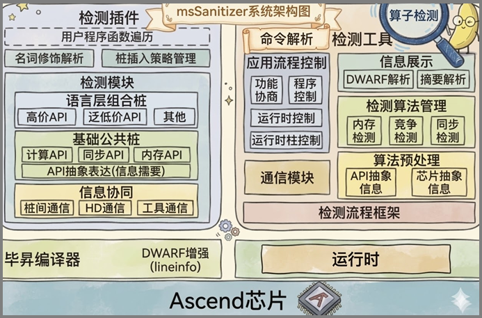

### 3.2 模块划分

系统由以下四个核心模块组成：

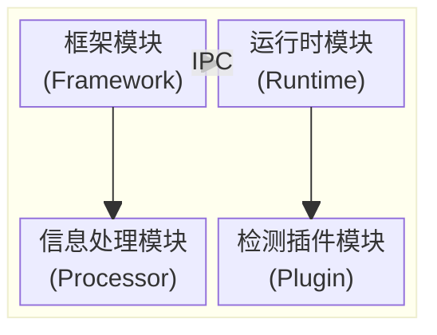
```mermaid
block-beta
    columns 8
    block:msSanitizer:1
        columns 4
        Framework["框架模块\n(Framework)"]:2
        Runtime["运行时模块\n(Runtime)"]:2
        space:4
        Processor["信息处理模块\n(Processor)"]:2
        Plugin["检测插件模块\n(Plugin)"]:2
    end
    Framework <-- "IPC" --> Runtime
    Framework --> Processor
    Runtime --> Plugin
```

各模块职责概览：

| 模块 | 职责 | 关键输入/输出 |
|-----|------|-------------|
| **框架模块** | 流程控制：命令行解析、进程拉起、进程间通信 | 输入：用户命令行参数；输出：检测配置、流程控制 |
| **运行时模块** | 信息采集：劫持运行时接口，收集用户进程行为数据 | 输入：运行时 API 调用；输出：操作信息上报 |
| **信息处理模块** | 异常分析：运行检测算法，生成检测报告 | 输入：运行时信息；输出：异常检测结果 |
| **检测插件模块** | 编译插桩：协同编译器插入检测桩函数 | 输入：插桩策略查询；输出：桩函数实现 |

### 3.3 软件单元清单

| 软件单元 | 描述 | 外部接口 | 内部接口 | 关系描述 |
|---------|------|---------|---------|---------|
| 框架模块 | 工具整体流程控制 | 工具命令行 | 通信服务端 | 实现命令行供用户调用；实现通信服务端与运行时模块传输数据；使用信息处理模块的信息输入接口 |
| 运行时模块 | 采集运行时数据并回传 | 无 | 通信客户端 | 实现通信客户端与框架模块传输数据；使用动态插桩插件完成动态插桩流程 |
| 信息处理模块 | 执行异常检测并输出结果 | 异常输出 | 信息输入接口 | 实现异常输出和信息输入接口，接收框架传入数据 |
| 检测插件模块 | 协同编译器完成插桩 | 插桩查询接口、指令桩实现 | 动态插桩插件 | 实现插桩查询接口供编译器查询；实现指令桩供静态插桩链接；实现动态插桩插件供运行时模块调用 |

---

## 4 系统上下文

下图展示了 msSanitizer 在使用场景中与外部系统的交互关系：

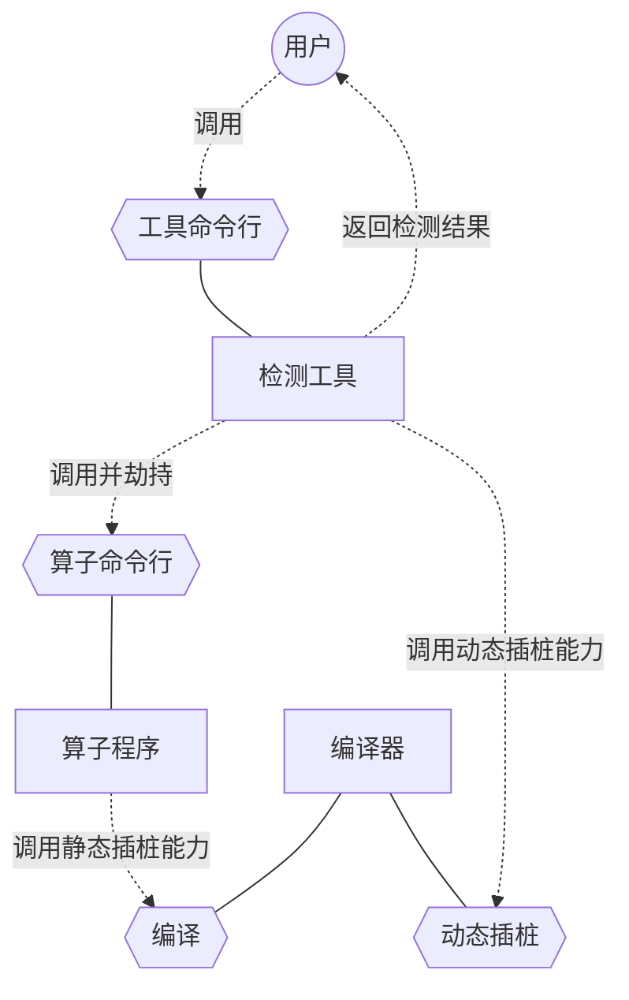
```mermaid
graph TB
    user(("用户"))
    sanitizer["检测工具"]
    kernel["算子程序"]
    compiler["编译器"]
    framework_cli{{"工具命令行"}}
    kernel_cli{{"算子命令行"}}
    compile_cli{{"编译"}}
    dbi_cli{{"动态插桩"}}

    user -.->|调用| framework_cli
    framework_cli --- sanitizer
    kernel_cli --- kernel
    compiler --- compile_cli
    compiler --- dbi_cli
    sanitizer -.->|调用并劫持| kernel_cli
    sanitizer -.->|调用动态插桩能力| dbi_cli
    kernel -.->|调用静态插桩能力| compile_cli
    sanitizer -.->|返回检测结果| user
```

**核心交互流程：**

1. 用户通过命令行调用 msSanitizer，传入待检测的算子程序
2. msSanitizer 拉起算子程序并劫持运行时接口
3. 编译器在编译阶段插入静态桩（通过检测插件）
4. 运行时模块在执行阶段收集行为数据并上报
5. 信息处理模块分析数据，检测异常并向用户报告结果

---

## 5 模块详细设计

### 5.1 框架模块 (Framework)

#### 5.1.1 功能描述

框架模块是工具的入口，负责从命令行启动到检测结束的全流程控制。核心功能包括：

1. 命令行参数解析与校验
2. `LD_PRELOAD` 环境变量设置与用户程序启动
3. 进程间通信
4. 算法模块创建与初始化
5. 异常信息收集与显示

#### 5.1.2 类设计

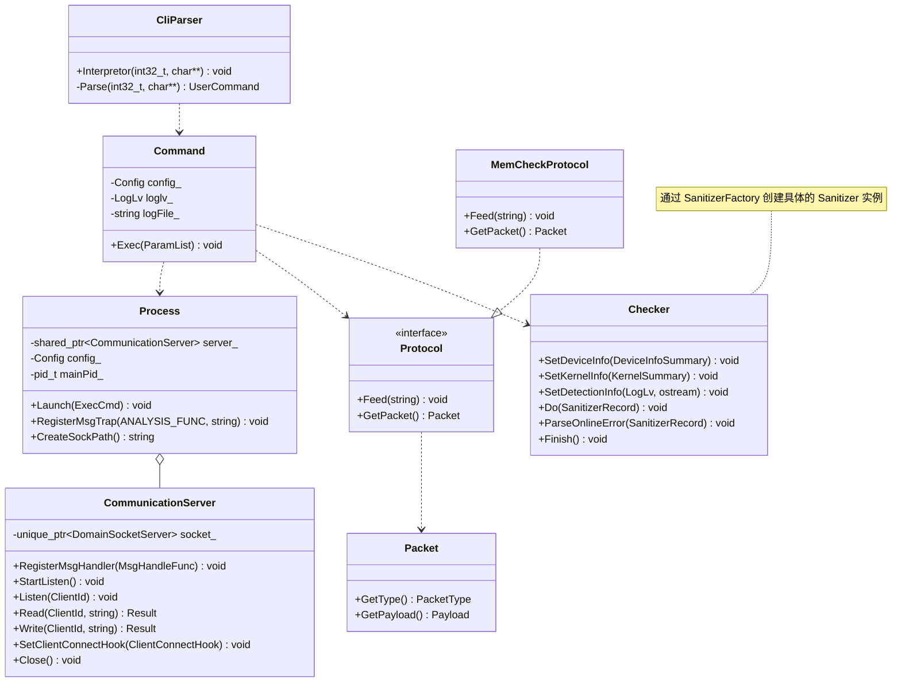
```mermaid
classDiagram
    class CliParser {
        +Interpretor(int32_t, char**) void
        -Parse(int32_t, char**) UserCommand
    }
    class Command {
        +Exec(ParamList) void
        -Config config_
        -LogLv loglv_
        -string logFile_
    }
    class Process {
        +Launch(ExecCmd) void
        +RegisterMsgTrap(ANALYSIS_FUNC, string) void
        +CreateSockPath() string
        -shared_ptr~CommunicationServer~ server_
        -Config config_
        -pid_t mainPid_
    }
    class CommunicationServer {
        -unique_ptr~DomainSocketServer~ socket_
        +RegisterMsgHandler(MsgHandleFunc) void
        +StartListen() void
        +Listen(ClientId) void
        +Read(ClientId, string) Result
        +Write(ClientId, string) Result
        +SetClientConnectHook(ClientConnectHook) void
        +Close() void
    }
    class Packet {
        +GetType() PacketType
        +GetPayload() Payload
    }
    class Protocol {
        <<interface>>
        +Feed(string) void
        +GetPacket() Packet
    }
    class MemCheckProtocol {
        +Feed(string) void
        +GetPacket() Packet
    }
    class Checker {
        +SetDeviceInfo(DeviceInfoSummary) void
        +SetKernelInfo(KernelSummary) void
        +SetDetectionInfo(LogLv, ostream) void
        +Do(SanitizerRecord) void
        +ParseOnlineError(SanitizerRecord) void
        +Finish() void
    }
    note for Checker "通过 SanitizerFactory 创建具体的 Sanitizer 实例"
    CliParser ..> Command
    Command ..> Process
    Process o-- CommunicationServer
    Command ..> Protocol
    Command ..> Checker
    Protocol ..> Packet
    MemCheckProtocol ..|> Protocol
```

#### 5.1.3 处理流程

1. 解析命令行参数，获取检测工具使能模式、用户二进制路径与启动命令
2. 根据使能模式选取对应的桩函数库，配置 `LD_PRELOAD` 环境变量
3. Fork 子进程，通过 `execvpe` 拉起用户程序，`LD_PRELOAD` 配置的运行时桩函数库完成符号替换
4. 向用户进程发送使能模式
5. 接收并解析运行时模块发送的操作记录
6. 将操作记录分发到已启用的检测工具

#### 5.1.4 异常报告显示

根据异常定位信息的详细程度，定位信息分为三种类型：

**异常调用栈**（最详细）：

```text
====== ERROR: illegal read of size 224
======    at 0x12c0c0015000 on GM
======    in block aiv(0) on device 0
======    code in pc current 0x77c (serialNo:10)
======    #0 .../kernel_operator_data_copy_impl.h:58:9
======    #1 .../inner_kernel_operator_data_copy_intf.cppm:58:9
======    #2 .../inner_kernel_operator_data_copy_intf.cppm:443:5
======    #3 illegal_read_and_write/illegal_read_and_write_kernel.cpp:18:5
```

**文件名与行号**：

```text
====== ERROR: illegal read of size 224
======    at 0x12c0c0015000 on GM
======    in block aiv(0) on device 0
======    code in illegal_read_and_write/illegal_read_and_write_kernel.cpp:18 (serialNo:10)
```

**无定位信息**（最简洁）：

```text
====== ERROR: illegal read of size 224
======    at 0x12c0c0015000 on GM
======    in block aiv(0) on device 0 (serialNo:10)
```

### 5.2 运行时模块 (Runtime)

#### 5.2.1 功能描述

运行时模块在用户进程内运行，对运行时函数做替换获取运行时信息，并与检测工具进程通信交互。交付件为若干动态库及配套头文件，动态库通过 `LD_PRELOAD` 实现函数劫持。

依据场景提供以下交付件：

| 场景 | 交付件 | 用途 |
|-----|--------|------|
| CANN 软件栈 - HAL 层 | `libascend_hal_hook.so` | HAL 层内存检测 |
| CANN 软件栈 - ACL 层 | `libascend_acl_hook.so` + `acl.h` | ACL 层内存检测 |
| AscendC 单算子 | `libmssanitizer_injection.so` | AscendC 单算子检测 |
| bisheng 算子 | `libascend_san_stub.so` | bisheng 算子内存检测 |

#### 5.2.2 核心功能

1. 提供进程间通信能力，与工具侧进行配置获取和信息上报
2. 提供接口劫持能力（通过同名函数 + `LD_PRELOAD` 实现）
3. 提供设备信息获取和上报能力（卡号、芯片型号等）
4. 提供算子 kernel 上下文管理和信息上报能力（blockDim、算子二进制、kernel name 等）
5. 提供信息记录内存管理能力
6. 提供 `kernelLaunch` 参数拼接能力，使能 kernel 侧桩函数
7. 提供动态插桩能力

#### 5.2.3 类设计

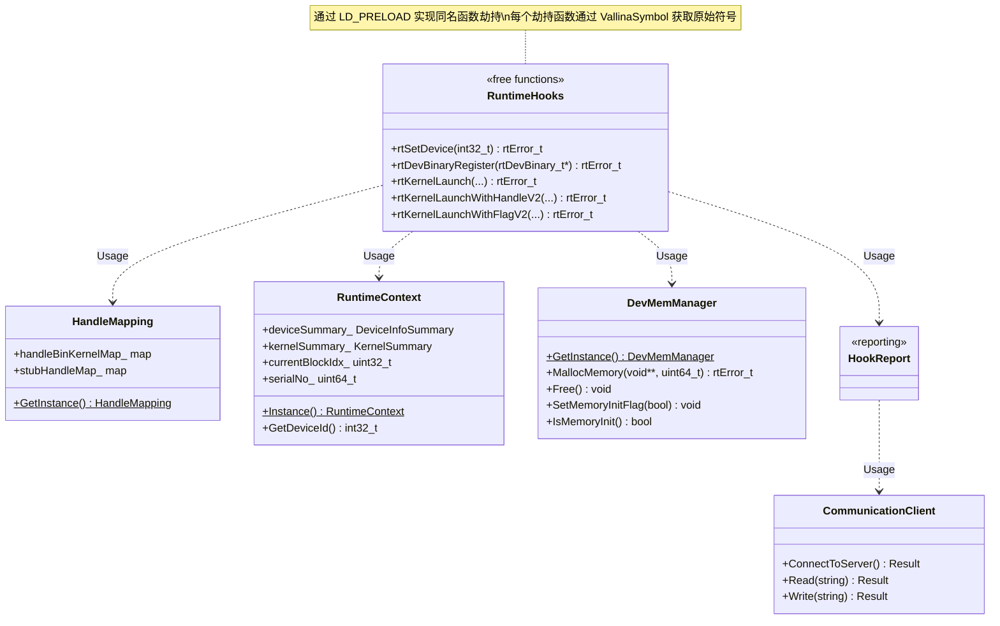
```mermaid
classDiagram
    class RuntimeHooks {
        <<free functions>>
        +rtSetDevice(int32_t) rtError_t
        +rtDevBinaryRegister(rtDevBinary_t*) rtError_t
        +rtKernelLaunch(...) rtError_t
        +rtKernelLaunchWithHandleV2(...) rtError_t
        +rtKernelLaunchWithFlagV2(...) rtError_t
    }
    note for RuntimeHooks "通过 LD_PRELOAD 实现同名函数劫持\n每个劫持函数通过 VallinaSymbol 获取原始符号"
    class HandleMapping {
        +GetInstance()$ HandleMapping
        +handleBinKernelMap_ map
        +stubHandleMap_ map
    }
    class RuntimeContext {
        +Instance()$ RuntimeContext
        +GetDeviceId() int32_t
        +deviceSummary_ DeviceInfoSummary
        +kernelSummary_ KernelSummary
        +currentBlockIdx_ uint32_t
        +serialNo_ uint64_t
    }
    class DevMemManager {
        +GetInstance()$ DevMemManager
        +MallocMemory(void**, uint64_t) rtError_t
        +Free() void
        +SetMemoryInitFlag(bool) void
        +IsMemoryInit() bool
    }
    class HookReport {
        <<reporting>>
    }
    class CommunicationClient {
        +ConnectToServer() Result
        +Read(string) Result
        +Write(string) Result
    }
    RuntimeHooks ..> HandleMapping : Usage
    RuntimeHooks ..> RuntimeContext : Usage
    RuntimeHooks ..> DevMemManager : Usage
    RuntimeHooks ..> HookReport : Usage
    HookReport ..> CommunicationClient : Usage
```

#### 5.2.4 处理流程

**通信流程：**

1. 首次触发通信接口，初始化 socket 通道，连接服务端获取检测模式
2. 获取设备信息并回传给服务端供检测工具初始化
3. 根据通信协议，通过 socket 通道传输协议头和协议体

**算子桩记录上报流程：**

1. 拦截 `rtKernelLaunch` 系列接口，调用 `__sanitizer_init` 完成 GM 内存预分配
2. 将预分配的 GM 内存指针传递至设备侧，kernel 函数运行时记录操作信息
3. kernel 函数完成后，将 GM 记录拷贝至 Host 侧，逐条解析并上报至检测工具

**mstx 接口流程：**

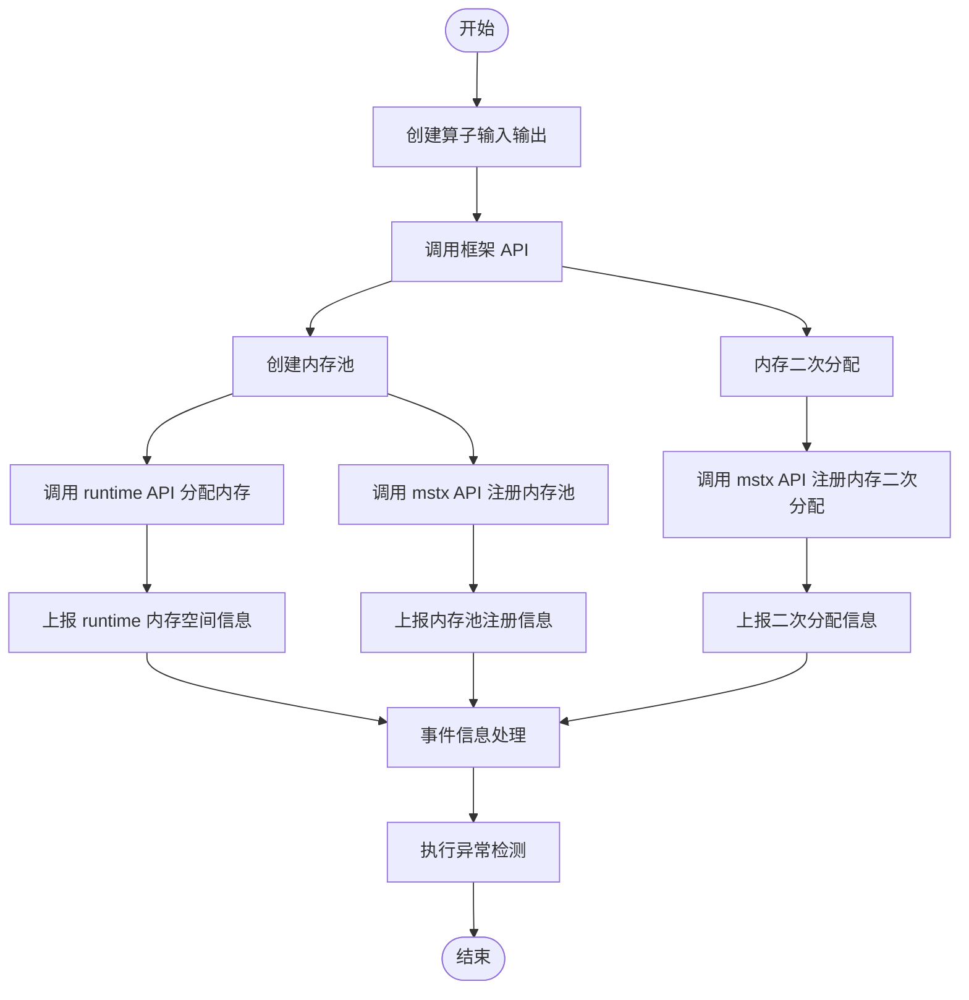
```mermaid
flowchart TD
    A([开始]) --> B[创建算子输入输出]
    B --> C[调用框架 API]
    C --> D[创建内存池]
    C --> H[内存二次分配]
    D --> E[调用 runtime API 分配内存]
    D --> F[调用 mstx API 注册内存池]
    E --> E1[上报 runtime 内存空间信息]
    F --> F1[上报内存池注册信息]
    H --> I[调用 mstx API 注册内存二次分配]
    I --> J[上报二次分配信息]
    E1 --> K[事件信息处理]
    F1 --> K
    J --> K
    K --> L[执行异常检测]
    L --> M([结束])
```

#### 5.2.5 动态插桩功能设计

动态插桩发生在算子 Launch 之前，实现在 `HijackedFuncOfKernelLaunch` 的 `Pre` 函数中。

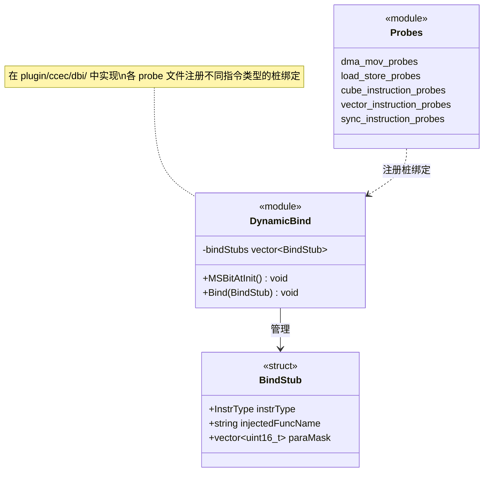
```mermaid
classDiagram
    class BindStub {
        <<struct>>
        +InstrType instrType
        +string injectedFuncName
        +vector~uint16_t~ paraMask
    }
    class DynamicBind {
        <<module>>
        +MSBitAtInit() void
        +Bind(BindStub) void
        -bindStubs vector~BindStub~
    }
    note for DynamicBind "在 plugin/ccec/dbi/ 中实现\n各 probe 文件注册不同指令类型的桩绑定"
    class Probes {
        <<module>>
        dma_mov_probes
        load_store_probes
        cube_instruction_probes
        vector_instruction_probes
        sync_instruction_probes
    }
    DynamicBind --> BindStub : 管理
    Probes ..> DynamicBind : 注册桩绑定
```

**动态插桩时序：**

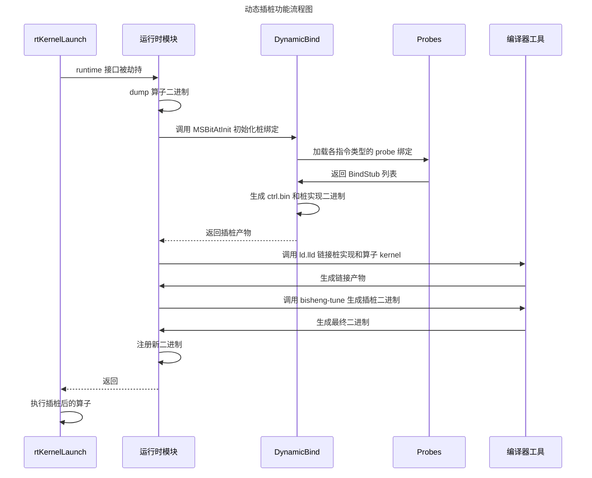
```mermaid
sequenceDiagram
    title 动态插桩功能流程图
    participant KernelLaunch as rtKernelLaunch
    participant Injection as 运行时模块
    participant DynamicBind as DynamicBind
    participant Probes as Probes
    participant Compiler as 编译器工具

    KernelLaunch->>Injection: runtime 接口被劫持
    Injection->>Injection: dump 算子二进制
    Injection->>DynamicBind: 调用 MSBitAtInit 初始化桩绑定
    DynamicBind->>Probes: 加载各指令类型的 probe 绑定
    Probes->>DynamicBind: 返回 BindStub 列表
    DynamicBind->>DynamicBind: 生成 ctrl.bin 和桩实现二进制
    DynamicBind-->>Injection: 返回插桩产物
    Injection->>Compiler: 调用 ld.lld 链接桩实现和算子 kernel
    Compiler->>Injection: 生成链接产物
    Injection->>Compiler: 调用 bisheng-tune 生成插桩二进制
    Compiler->>Injection: 生成最终二进制
    Injection->>Injection: 注册新二进制
    Injection-->>KernelLaunch: 返回
    KernelLaunch->>KernelLaunch: 执行插桩后的算子
```

### 5.3 信息处理模块 (Processor)

#### 5.3.1 功能描述

1. 提供检测算法的管理功能，通过 `SanitizerFactory`/`RegisteSanitizer` 实现算法注册与创建
2. 提供检测记录分发功能，`Checker` 将运行时记录分发到各检测工具
3. 提供检测工具间并行处理能力，每种 `ToolType` 对应独立的消费者线程
4. 提供桩记录预处理功能，将原始指令记录处理为统一描述
5. 提供内存检测算法（非法读写、非对齐访问、内存泄漏、非法释放）
6. 提供竞争检测算法（核间检测、流水间检测、流水内检测）
7. 提供未初始化检测算法
8. 提供同步检测算法（set_flag/wait_flag 配对检测）
9. 提供寄存器默认值检测

#### 5.3.2 类设计

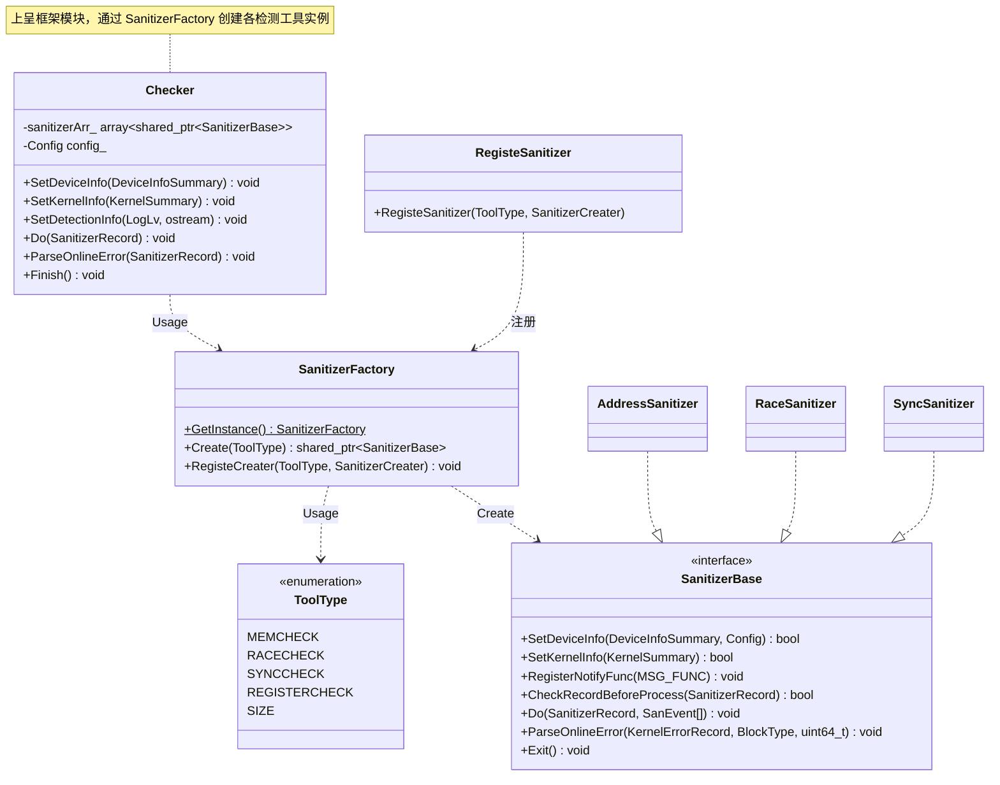
```mermaid
classDiagram
    class Checker {
        +SetDeviceInfo(DeviceInfoSummary) void
        +SetKernelInfo(KernelSummary) void
        +SetDetectionInfo(LogLv, ostream) void
        +Do(SanitizerRecord) void
        +ParseOnlineError(SanitizerRecord) void
        +Finish() void
        -sanitizerArr_ array~shared_ptr~SanitizerBase~~
        -Config config_
    }
    note for Checker "上呈框架模块，通过 SanitizerFactory 创建各检测工具实例"
    class SanitizerBase {
        <<interface>>
        +SetDeviceInfo(DeviceInfoSummary, Config) bool
        +SetKernelInfo(KernelSummary) bool
        +RegisterNotifyFunc(MSG_FUNC) void
        +CheckRecordBeforeProcess(SanitizerRecord) bool
        +Do(SanitizerRecord, SanEvent[]) void
        +ParseOnlineError(KernelErrorRecord, BlockType, uint64_t) void
        +Exit() void
    }
    class AddressSanitizer
    class RaceSanitizer
    class SyncSanitizer
    class ToolType {
        <<enumeration>>
        MEMCHECK
        RACECHECK
        SYNCCHECK
        REGISTERCHECK
        SIZE
    }
    class SanitizerFactory {
        +GetInstance()$ SanitizerFactory
        +Create(ToolType) shared_ptr~SanitizerBase~
        +RegisteCreater(ToolType, SanitizerCreater) void
    }
    class RegisteSanitizer {
        +RegisteSanitizer(ToolType, SanitizerCreater)
    }
    Checker ..> SanitizerFactory : Usage
    SanitizerFactory ..> ToolType : Usage
    SanitizerFactory ..> SanitizerBase : Create
    RegisteSanitizer ..> SanitizerFactory : 注册
    AddressSanitizer ..|> SanitizerBase
    RaceSanitizer ..|> SanitizerBase
    SyncSanitizer ..|> SanitizerBase
```

#### 5.3.3 检测算法管理

检测功能与检测算法之间存在一对多/多对一的关系：

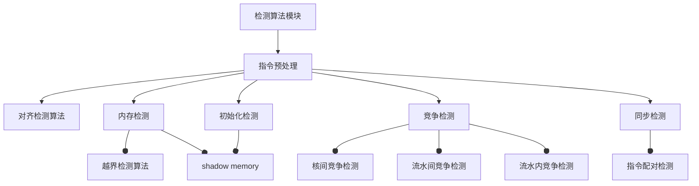
```mermaid
graph TD
    algorithm[检测算法模块] --> preprocess[指令预处理]
    preprocess --> aligncheck[对齐检测算法]
    preprocess --> memcheck[内存检测]
    preprocess --> initcheck[初始化检测]
    preprocess --> racecheck[竞争检测]
    preprocess --> synccheck[同步检测]
    memcheck --o boundscheck[越界检测算法]
    memcheck --o shadowmemory[shadow memory]
    initcheck --o shadowmemory
    racecheck --o intercore[核间竞争检测]
    racecheck --o interpipe[流水间竞争检测]
    racecheck --o innerpipe[流水内竞争检测]
    synccheck --o syncpair[指令配对检测]
```

`SanitizerFactory` 提供算法注册和创建功能：

- **算法注册**：通过 `RegisteSanitizer` 类在全局初始化阶段完成，提供检测功能类型 `ToolType` 和算法创建方法
- **从属关系存储**：以 `unordered_map<ToolType, SanitizerCreater>` 类型表示
- **算法创建**：由 `Checker` 调用 `SanitizerFactory::Create(ToolType)` 方法创建对应的检测算法实例

#### 5.3.4 检测工具实例化与分发

`Checker` 在初始化时，通过 `SanitizerFactory` 为每种启用的 `ToolType` 创建对应的 `SanitizerBase` 实例，存储在 `sanitizerArr_` 数组中。每条运行时记录到达时，`Checker` 将其分发给所有已初始化的检测工具实例。

#### 5.3.5 检测记录分发与并行处理

`Checker` 采用生产者-消费者模型实现检测工具间并行。每种 `ToolType` 对应一个消费者线程，独立处理各自的检测记录队列：

1. `Checker` 初始化时为每种启用的工具创建消费者线程 (`ConsumeRecordThread`)
2. 运行时记录到达时，`Checker` 将记录放入对应工具的工作队列 (`workerArgs_`)
3. 消费者线程通过条件变量 (`workerCv_`/`producerCv_`) 等待和唤醒
4. 所有记录处理完毕后，`Checker::Finish()` 通知消费者线程退出

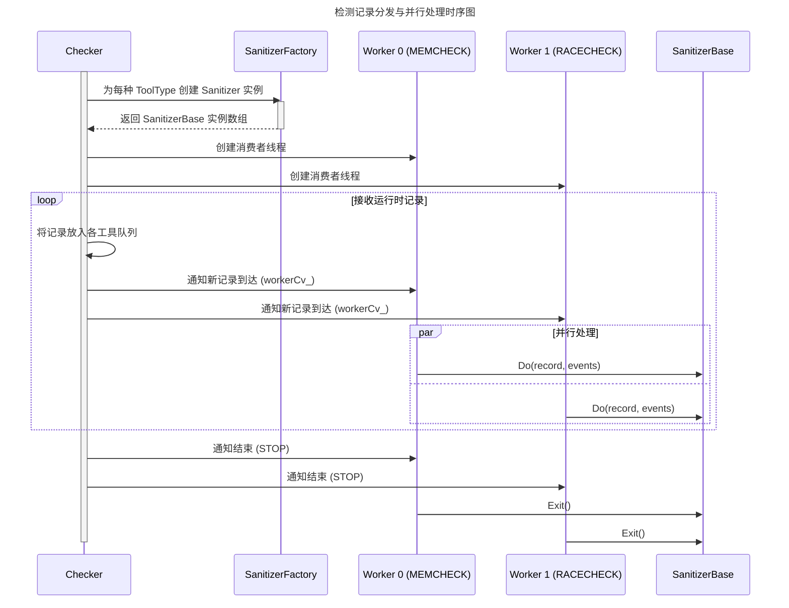
```mermaid
sequenceDiagram
    title 检测记录分发与并行处理时序图
    participant Checker
    participant SanitizerFactory
    participant 消费者线程0 as Worker 0 (MEMCHECK)
    participant 消费者线程1 as Worker 1 (RACECHECK)
    participant SanitizerBase

    activate Checker
    Checker->>SanitizerFactory: 为每种 ToolType 创建 Sanitizer 实例
    activate SanitizerFactory
    SanitizerFactory-->>Checker: 返回 SanitizerBase 实例数组
    deactivate SanitizerFactory
    Checker->>消费者线程0: 创建消费者线程
    Checker->>消费者线程1: 创建消费者线程
    loop 接收运行时记录
        Checker->>Checker: 将记录放入各工具队列
        Checker->>消费者线程0: 通知新记录到达 (workerCv_)
        Checker->>消费者线程1: 通知新记录到达 (workerCv_)
        par 并行处理
            消费者线程0->>SanitizerBase: Do(record, events)
        and
            消费者线程1->>SanitizerBase: Do(record, events)
        end
    end
    Checker->>消费者线程0: 通知结束 (STOP)
    Checker->>消费者线程1: 通知结束 (STOP)
    消费者线程0->>SanitizerBase: Exit()
    消费者线程1->>SanitizerBase: Exit()
    deactivate Checker
```

#### 5.3.6 内存检测算法

内存检测支持以下异常类型：

| 异常类型 | 描述 | 支持内存类型 |
|---------|------|------------|
| 多核踩踏 | 不同核写入的 GM 内存范围存在重叠 | GM |
| 非法读写 | GM：访问未申请范围；片上内存：访问物理大小之外的范围 | GM、UB、L1、L0{ABC} |
| 非对齐访问 | 内存地址不满足对齐要求 | GM、UB、L1、L0{ABC} |
| 内存泄漏 | 内存申请但未释放 | GM |
| 非法释放 | 对未分配地址释放或重复释放 | GM |
| 内存未使用 | 内存申请后未使用 | GM |
| 未初始化 | 读取未初始化的内存值 | GM、UB、L1、L0{ABC}、Private |

**核心类关系：**

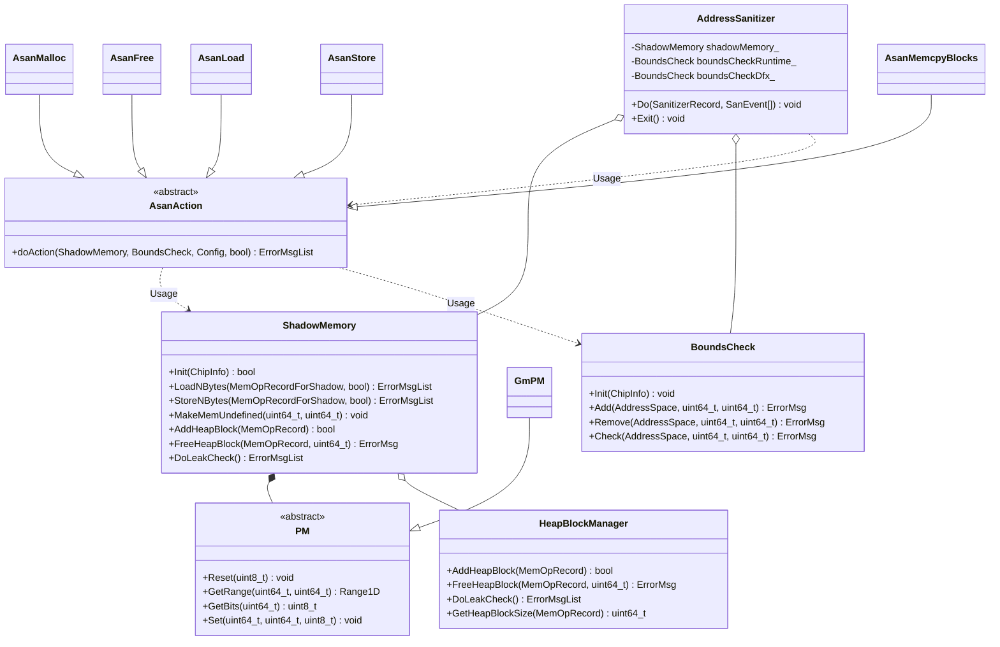
```mermaid
classDiagram
    class AddressSanitizer {
        +Do(SanitizerRecord, SanEvent[]) void
        +Exit() void
        -ShadowMemory shadowMemory_
        -BoundsCheck boundsCheckRuntime_
        -BoundsCheck boundsCheckDfx_
    }
    class ShadowMemory {
        +Init(ChipInfo) bool
        +LoadNBytes(MemOpRecordForShadow, bool) ErrorMsgList
        +StoreNBytes(MemOpRecordForShadow, bool) ErrorMsgList
        +MakeMemUndefined(uint64_t, uint64_t) void
        +AddHeapBlock(MemOpRecord) bool
        +FreeHeapBlock(MemOpRecord, uint64_t) ErrorMsg
        +DoLeakCheck() ErrorMsgList
    }
    class PM {
        <<abstract>>
        +Reset(uint8_t) void
        +GetRange(uint64_t, uint64_t) Range1D
        +GetBits(uint64_t) uint8_t
        +Set(uint64_t, uint64_t, uint8_t) void
    }
    class GmPM
    class HeapBlockManager {
        +AddHeapBlock(MemOpRecord) bool
        +FreeHeapBlock(MemOpRecord, uint64_t) ErrorMsg
        +DoLeakCheck() ErrorMsgList
        +GetHeapBlockSize(MemOpRecord) uint64_t
    }
    class BoundsCheck {
        +Init(ChipInfo) void
        +Add(AddressSpace, uint64_t, uint64_t) ErrorMsg
        +Remove(AddressSpace, uint64_t, uint64_t) ErrorMsg
        +Check(AddressSpace, uint64_t, uint64_t) ErrorMsg
    }
    class AsanAction {
        <<abstract>>
        +doAction(ShadowMemory, BoundsCheck, Config, bool) ErrorMsgList
    }
    class AsanMalloc
    class AsanFree
    class AsanLoad
    class AsanStore
    class AsanMemcpyBlocks
    GmPM --|> PM
    AsanMalloc --|> AsanAction
    AsanFree --|> AsanAction
    AsanLoad --|> AsanAction
    AsanStore --|> AsanAction
    AsanMemcpyBlocks --|> AsanAction
    AddressSanitizer o-- ShadowMemory
    AddressSanitizer o-- BoundsCheck
    ShadowMemory *-- PM
    ShadowMemory o-- HeapBlockManager
    AddressSanitizer ..> AsanAction : Usage
    AsanAction ..> ShadowMemory : Usage
    AsanAction ..> BoundsCheck : Usage
```

**ShadowMemory LoadNBytes 流程：**

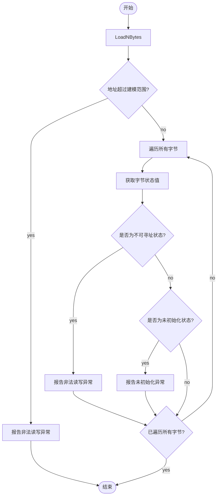
```mermaid
flowchart TD
    A([开始]) --> B[LoadNBytes]
    B --> C{地址超过建模范围?}
    C -->|yes| D[报告非法读写异常]
    C -->|no| E[遍历所有字节]
    E --> F[获取字节状态值]
    F --> G{是否为不可寻址状态?}
    G -->|yes| H[报告非法读写异常]
    G -->|no| I{是否为未初始化状态?}
    I -->|yes| J[报告未初始化异常]
    I -->|no| K{已遍历所有字节?}
    H --> K
    J --> K
    K -->|no| E
    K -->|yes| L([结束])
    D --> L
```

**内存检测上下文切换：**

在多算子调用场景下，`AddressSanitizer` 维护两份 `BoundsCheck` 实例（`SCOPE_RUNTIME` 和 `SCOPE_DFX`），在 runtime 指令与 dfx 指令之间完成上下文切换：

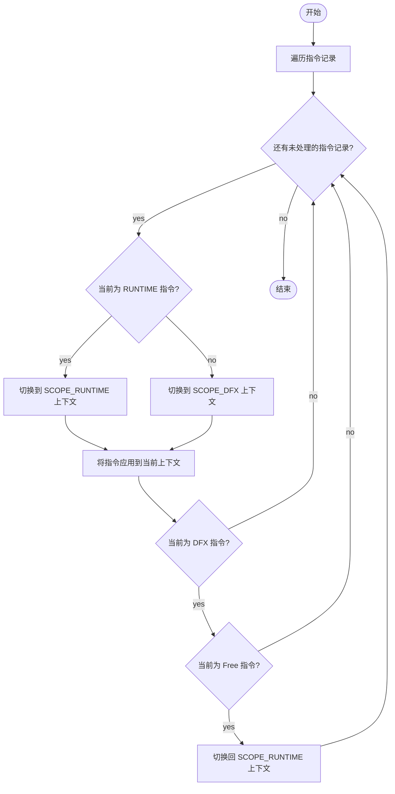
```mermaid
flowchart TD
    A([开始]) --> B[遍历指令记录]
    B --> C{还有未处理的指令记录?}
    C -->|yes| D{当前为 RUNTIME 指令?}
    D -->|yes| E[切换到 SCOPE_RUNTIME 上下文]
    D -->|no| F[切换到 SCOPE_DFX 上下文]
    E --> G[将指令应用到当前上下文]
    F --> G
    G --> H{当前为 DFX 指令?}
    H -->|yes| I{当前为 Free 指令?}
    I -->|yes| J[切换回 SCOPE_RUNTIME 上下文]
    I -->|no| C
    J --> C
    H -->|no| C
    C -->|no| K([结束])
```

#### 5.3.7 共享内存支持

单机多卡场景下，CANN 软件栈通过 IPC 接口实现卡间内存共享。工具需要在共享内存操作时正确同步 ShadowMemory 状态。

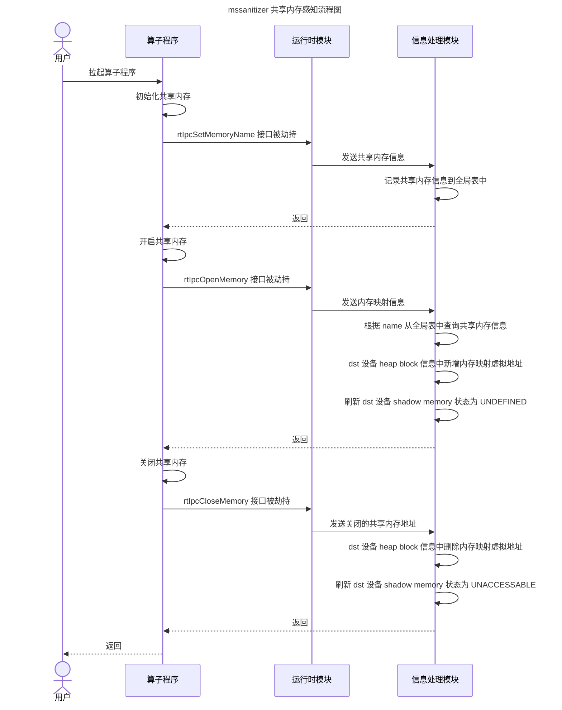
```mermaid
sequenceDiagram
    title mssanitizer 共享内存感知流程图
    actor user as 用户
    participant program as 算子程序
    participant runtime as 运行时模块
    participant process as 信息处理模块

    user->>program: 拉起算子程序
    program->>program: 初始化共享内存
    program->>runtime: rtIpcSetMemoryName 接口被劫持
    runtime->>process: 发送共享内存信息
    process->>process: 记录共享内存信息到全局表中
    process-->>program: 返回
    program->>program: 开启共享内存
    program->>runtime: rtIpcOpenMemory 接口被劫持
    runtime->>process: 发送内存映射信息
    process->>process: 根据 name 从全局表中查询共享内存信息
    process->>process: dst 设备 heap block 信息中新增内存映射虚拟地址
    process->>process: 刷新 dst 设备 shadow memory 状态为 UNDEFINED
    process-->>program: 返回
    program->>program: 关闭共享内存
    program->>runtime: rtIpcCloseMemory 接口被劫持
    runtime->>process: 发送关闭的共享内存地址
    process->>process: dst 设备 heap block 信息中删除内存映射虚拟地址
    process->>process: 刷新 dst 设备 shadow memory 状态为 UNACCESSABLE
    process-->>program: 返回
    program-->>user: 返回
```

共享内存信息通过 `Command` 类的静态成员管理：

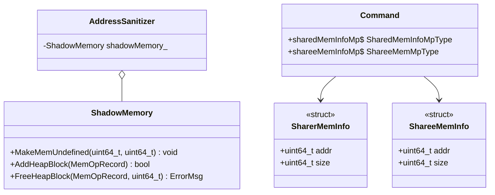
```mermaid
classDiagram
    class AddressSanitizer {
        -ShadowMemory shadowMemory_
    }
    class ShadowMemory {
        +MakeMemUndefined(uint64_t, uint64_t) void
        +AddHeapBlock(MemOpRecord) bool
        +FreeHeapBlock(MemOpRecord, uint64_t) ErrorMsg
    }
    class Command {
        +sharedMemInfoMp$ SharedMemInfoMpType
        +shareeMemInfoMp$ ShareeMemMpType
    }
    class SharerMemInfo {
        <<struct>>
        +uint64_t addr
        +uint64_t size
    }
    class ShareeMemInfo {
        <<struct>>
        +uint64_t addr
        +uint64_t size
    }
    AddressSanitizer o-- ShadowMemory
    Command --> SharerMemInfo
    Command --> ShareeMemInfo
```

#### 5.3.8 同步检测算法

同步检测通过 `synccheck` 子工具提供，当前支持 `set_flag`/`wait_flag` 配对检测。

```c
void set_flag(pipe_t pipe, pipe_t tpipe, event_t eventID);
void wait_flag(pipe_t pipe, pipe_t tpipe, event_t eventID);
```

以 `(src, dst, eventId)` 三元组作为同步事件的唯一标识，算法流程如下：

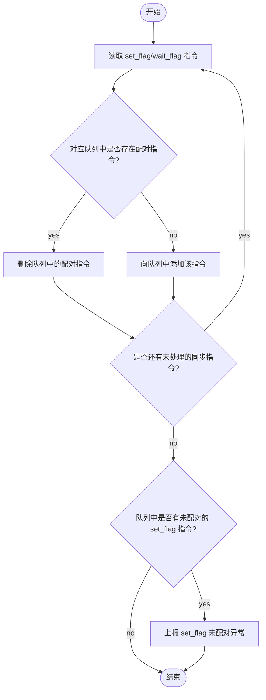
```mermaid
flowchart TD
    A([开始]) --> B[读取 set_flag/wait_flag 指令]
    B --> C{对应队列中是否存在配对指令?}
    C -->|yes| D[删除队列中的配对指令]
    C -->|no| E[向队列中添加该指令]
    D --> F{是否还有未处理的同步指令?}
    E --> F
    F -->|yes| B
    F -->|no| G{队列中是否有未配对的 set_flag 指令?}
    G -->|yes| H[上报 set_flag 未配对异常]
    G -->|no| I([结束])
    H --> I
```

异常报告示例：

```text
====== WARNING: Unpaired set_flag instructions detected
======    from PIPE_MTE2 to PIPE_MTE3 in hardware_sync_mix_mix_aic
======    in block aiv(0) on device 1
======    code in pc current 0x1b280 (serialNo:8)
======    #0 kernel.cpp:28:5
```

#### 5.3.9 检测算法间并行

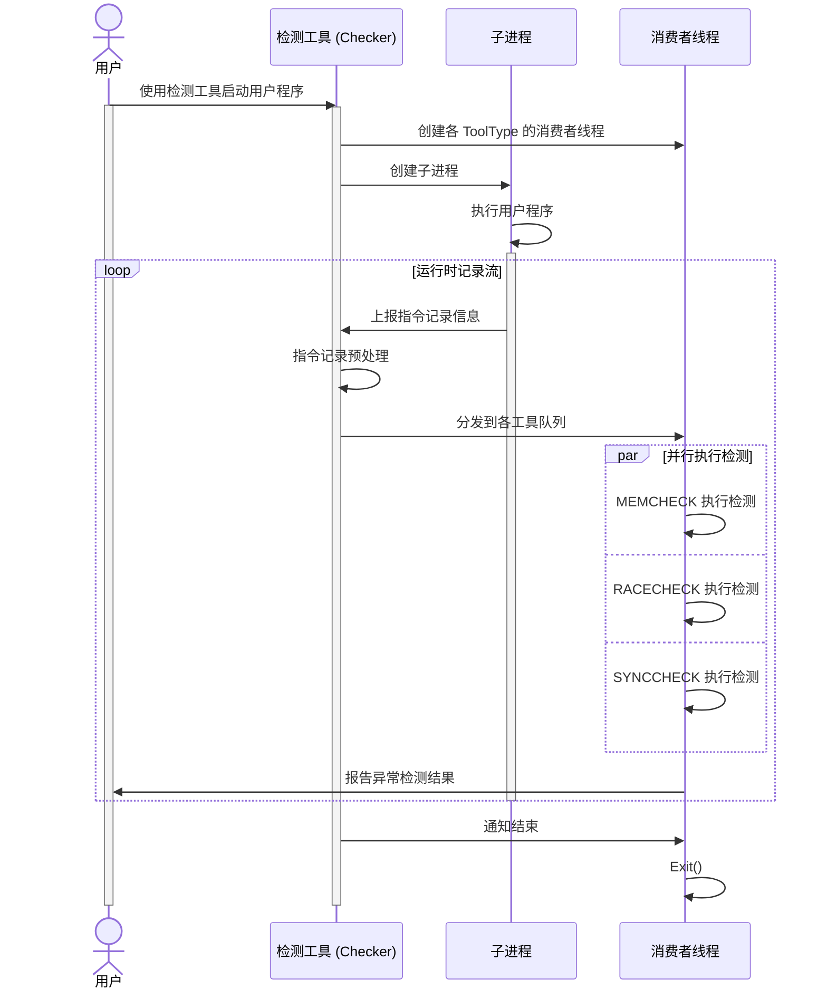
```mermaid
sequenceDiagram
    actor user as 用户
    participant sanitizer as 检测工具 (Checker)
    participant subprocess as 子进程
    participant workers as 消费者线程

    user->>sanitizer: 使用检测工具启动用户程序
    activate user
    activate sanitizer
    sanitizer->>workers: 创建各 ToolType 的消费者线程
    sanitizer->>subprocess: 创建子进程
    subprocess->>subprocess: 执行用户程序
    activate subprocess
    loop 运行时记录流
        subprocess->>sanitizer: 上报指令记录信息
        sanitizer->>sanitizer: 指令记录预处理
        sanitizer->>workers: 分发到各工具队列
        par 并行执行检测
            workers->>workers: MEMCHECK 执行检测
        and
            workers->>workers: RACECHECK 执行检测
        and
            workers->>workers: SYNCCHECK 执行检测
        end
        workers->>user: 报告异常检测结果
    end
    deactivate subprocess
    sanitizer->>workers: 通知结束
    workers->>workers: Exit()
    deactivate user
    deactivate sanitizer
```

### 5.4 检测插件模块 (Plugin)

#### 5.4.1 插桩维度

检测插件模块从两个维度进行分类组合：

| 维度 | 选项 | 说明 |
|------|-----|------|
| **插桩时机** | 静态插桩 | 编译期插入桩函数，支持调用栈，需重新编译 |
| | 动态插桩 | 运行时替换算子二进制，无需重编译，不支持调用栈 |
| **检测时机** | Host 侧检测 | 桩函数记录信息上报工具侧，算法复杂度更高 |
| | Device 侧检测 | 桩函数直接执行检测算法，适合整网/图模式场景 |

当前提供三种插件：Host 侧检测的静态/动态插桩插件，Device 侧检测的动态插桩插件。

#### 5.4.2 静态插桩流程

交付件：插桩查询库 `libsanitizer_api.so`（host 架构）+ 桩实现库 `libsanitizer_stub_dav-xxx.a`（device 架构）。

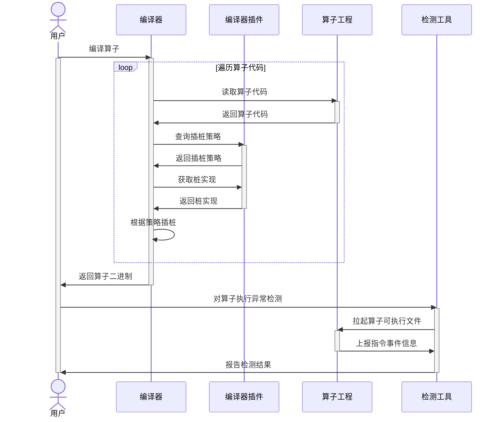
```mermaid
sequenceDiagram
    actor user as 用户
    participant compiler as 编译器
    participant plugin as 编译器插件
    participant project as 算子工程
    participant sanitizer as 检测工具

    user->>compiler: 编译算子
    activate user
    activate compiler
    loop 遍历算子代码
        compiler->>project: 读取算子代码
        activate project
        project->>compiler: 返回算子代码
        deactivate project
        compiler->>plugin: 查询插桩策略
        activate plugin
        plugin->>compiler: 返回插桩策略
        compiler->>plugin: 获取桩实现
        plugin->>compiler: 返回桩实现
        deactivate plugin
        compiler->>compiler: 根据策略插桩
    end
    compiler->>user: 返回算子二进制
    deactivate compiler
    user->>sanitizer: 对算子执行异常检测
    activate sanitizer
    sanitizer->>project: 拉起算子可执行文件
    activate project
    project->>sanitizer: 上报指令事件信息
    deactivate project
    sanitizer->>user: 报告检测结果
    deactivate sanitizer
    deactivate user
```

#### 5.4.3 动态插桩流程

交付件：`libsanplugin_boundscheck.so`（host 侧动态库，内含各架构 `.dav` 段的桩实现）。

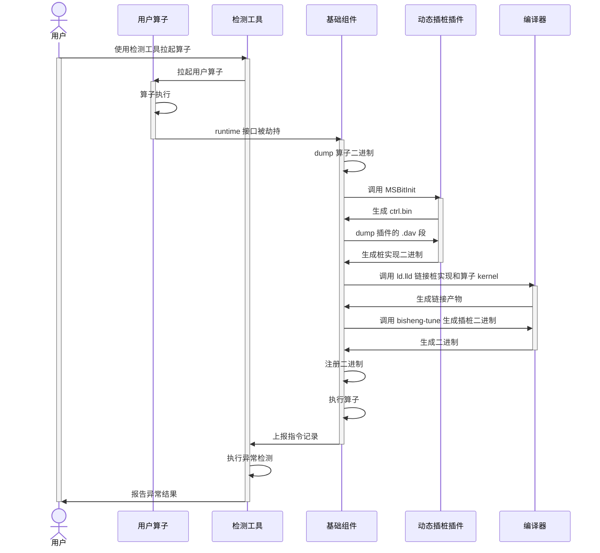
```mermaid
sequenceDiagram
    actor user as 用户
    participant kernel as 用户算子
    participant sanitizer as 检测工具
    participant injection as 基础组件
    participant plugin as 动态插桩插件
    participant compiler as 编译器

    user->>sanitizer: 使用检测工具拉起算子
    activate user
    activate sanitizer
    sanitizer->>kernel: 拉起用户算子
    activate kernel
    kernel->>kernel: 算子执行
    kernel->>injection: runtime 接口被劫持
    deactivate kernel
    activate injection
    injection->>injection: dump 算子二进制
    injection->>plugin: 调用 MSBitInit
    activate plugin
    plugin->>injection: 生成 ctrl.bin
    injection->>plugin: dump 插件的 .dav 段
    plugin->>injection: 生成桩实现二进制
    deactivate plugin
    injection->>compiler: 调用 ld.lld 链接桩实现和算子 kernel
    activate compiler
    compiler->>injection: 生成链接产物
    injection->>compiler: 调用 bisheng-tune 生成插桩二进制
    compiler->>injection: 生成二进制
    deactivate compiler
    injection->>injection: 注册二进制
    injection->>injection: 执行算子
    injection->>sanitizer: 上报指令记录
    deactivate injection
    sanitizer->>sanitizer: 执行异常检测
    sanitizer->>user: 报告异常结果
    deactivate user
    deactivate sanitizer
```

#### 5.4.4 Device 侧检测

Device 侧检测充分利用 Scalar 计算资源，在 kernel 运行时直接完成检测，分三步：

1. **Tensor 信息传递**：将算子输入输出 tensor 的地址和长度写入预分配 GM 的指定位置
2. **越界检测**：边处理边检测，遍历 TensorInfo 依次判定内存访问是否在有效范围内
3. **检测结果上报**：结果写入 GM，kernel 结束后上报至工具侧

Device 侧检测设计需注意：Scalar 算力有限需考虑性能影响；不支持 C++ 标准库容器；中间结果需在 GM 上持久化。

---

## 6 模块交互

### 6.1 逻辑视图

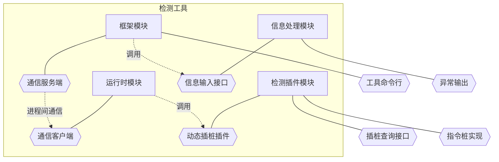
```mermaid
graph TB
    subgraph sanitizer[检测工具]
        framework[框架模块]
        processor[信息处理模块]
        runtime[运行时模块]
        plugin[检测插件模块]
        record_input{{"信息输入接口"}}
        server{{"通信服务端"}}
        client{{"通信客户端"}}
        dbi_plugin{{"动态插桩插件"}}

        processor --- record_input
        framework --- server
        runtime --- client
        plugin --- dbi_plugin

        framework -.->|调用| record_input
        server -.->|进程间通信| client
        runtime -.->|调用| dbi_plugin
    end

    framework_cli{{"工具命令行"}}
    query{{"插桩查询接口"}}
    instruction{{"指令桩实现"}}
    output{{"异常输出"}}

    framework --- framework_cli
    processor --- output
    plugin --- query
    plugin --- instruction
```

### 6.2 数据流

```mermaid
flowchart TD
    CLI[用户命令行] --> Framework[框架模块]
    Framework -- 配置参数 --> Runtime[运行时模块]
    Runtime -- 运行时信息 --> Framework
    Framework -- 运行时信息 --> Processor[信息处理模块]
    Processor -- 异常报告 --> User[用户]
    Plugin[检测插件模块] -- 策略查询 --> Compiler[编译器]
    Compiler -- 桩函数调用 --> Plugin
```

---

## 7 接口设计

### 7.1 命令行接口

<a id="command-line-interface-desc"></a>

**主命令选项：**

| 命令 | 功能描述 |
|-----|---------|
| `-h, --help` | 显示工具使用帮助 |
| `-v, --version` | 查询版本号信息 |
| `-t, --tool <name>` | 指定检测工具模块：`memcheck`、`racecheck`、`initcheck`、`synccheck`，通过 `\|` 分隔同时启用多个（如 `memcheck\|racecheck`），默认启用所有 |
| `--log-file <file>` | 保存 log 信息到指定文件，不指定则打印 |
| `--log-level <level>` | 指定打印级别，默认为 warn |
| `--max-debuglog-size <size>` | 指定单个 debug 日志文件大小 |
| `--kernel-name <string>` | 指定要检测的 kernel name（仅图下沉模式），默认全量 |
| `--block-id <uint>` | 检测指定核心，使能时跨核检测被抑制，默认所有核心 |
| `--cache-size <uint>` | 单位 MB，指定每核心的缓存资源分配量，默认 100 |
| `--full-backtrace <yes\|no>` | 启用完整调用栈打印 |
| `--demangle <mode>` | 指定符号名还原模式 |

**内存检测子选项：**

| 命令 | 功能描述 |
|-----|---------|
| `--leak-check <yes\|no>` | 启用内存泄漏检测 |
| `--check-unused-memory <yes\|no>` | 启用内存未使用检测 |
| `--check-device-heap <yes\|no>` | 检查 HAL 接口内存异常 |
| `--check-cann-heap <yes\|no>` | 检查 ACL 接口内存异常 |

### 7.2 进程间通信接口

<a id="process-communication-interface-desc"></a>

```c++
class CommunicationServer {
public:
    using ClientId = std::size_t;
    using MsgResponseFunc = std::function<void(const std::string&)>;
    using MsgHandleFunc = std::function<void(std::string, MsgResponseFunc&)>;
    using ClientConnectHook = std::function<void(ClientId)>;

    explicit CommunicationServer(const std::string& socketPath);
    void RegisterMsgHandler(const MsgHandleFunc &func);
    void StartListen();
    void Listen(ClientId clientId);
    Result Read(ClientId clientId, std::string &msg);
    Result Write(ClientId clientId, std::string const& msg);
    void SetClientConnectHook(ClientConnectHook &&hook);
    void Close();
};

class CommunicationClient {
public:
    explicit CommunicationClient(std::string socketPath);
    Result ConnectToServer();
    Result Read(std::string &msg);
    Result Write(std::string const &msg);
};
```

### 7.3 通信协议

<a id="process-communication-protocol-desc"></a>

框架模块与运行时模块之间的通信流程：

```mermaid
sequenceDiagram
    title 框架模块与运行时模块间通信流程图
    participant framework as 框架模块
    participant runtime as 运行时模块

    framework->>runtime: 传输工具配置 Config
    loop 运行时信息
        alt 发送设备信息
            runtime->>framework: PacketType::DEVICE_SUMMARY
            runtime->>framework: DeviceInfoSummary
        else 发送算子信息
            runtime->>framework: PacketType::KERNEL_SUMMARY
            runtime->>framework: KernelSummary
        else 发送算子二进制
            runtime->>framework: PacketType::KERNEL_BINARY
            runtime->>framework: char[]
        else 发送 Host 侧内存操作记录
            runtime->>framework: PacketType::HOST_RECORD
            runtime->>framework: HostMemRecord
        else 发送 Kernel 侧内存操作记录
            runtime->>framework: PacketType::KERNEL_RECORD
            runtime->>framework: char[]
        else 发送 IPC 操作记录
            runtime->>framework: PacketType::IPC_RECORD
            runtime->>framework: IPCMemRecord
        else 发送 SanitizerRecord
            runtime->>framework: PacketType::SANITIZER_RECORD
            runtime->>framework: SanitizerRecord
        end
    end
```

**核心协议结构体：**

```c++
struct Config {
    bool defaultCheck;
    bool memCheck;
    bool raceCheck;
    bool initCheck;
    bool syncCheck;
    bool registerCheck;
    bool checkDeviceHeap;
    bool checkCannHeap;
    bool leakCheck;
    bool checkUnusedMemory;
    bool isPrintFullStack{false};
    int16_t checkBlockId = -1;
    uint32_t cacheSize = 100;
    DemangleMode demangleMode{DemangleMode::FULL_DEMANGLED_NAME};
    char pluginPath[PLUGIN_PATH_MAX];
    char kernelName[KERNEL_NAME_MAX];
    char dumpPath[DUMP_PATH_MAX];
};

enum class PacketType : uint32_t {
    DEVICE_SUMMARY = 0,
    KERNEL_SUMMARY,
    KERNEL_BINARY,
    LOG_STRING,
    HOST_RECORD = 1000,
    KERNEL_RECORD,
    IPC_RECORD,
    SANITIZER_RECORD,
    IPC_RESPONSE = 3000,
    KERNEL_RECORD_RESPONSE,
    INVALID = ~0U,
};

struct DeviceInfoSummary {
    DeviceType device;
    uint32_t blockSize;
    uint32_t blockNum;
    int32_t deviceId;
};

struct KernelSummary {
    uint64_t pcStartAddr;
    uint32_t blockDim;
    KernelType kernelType;
    bool isKernelWithDBI;
    bool hasDebugLine;
    char kernelName[KERNEL_NAME_MAX];
};

struct HostMemRecord {
    MemOpType type;
    MemInfoSrc infoSrc;
    MemInfoDesc infoDesc;
    uint64_t srcAddr;
    uint64_t dstAddr;
    uint64_t memSize;
    uint64_t paramsNo;
    uint64_t rootAddr;
};
```

### 7.4 运行时模块接口清单

<a id="runtime-injection-interface-list"></a>

**HAL 接口：**

| 接口 | 描述 |
|-----|------|
| `halMemAlloc(void **, uint64_t, uint64_t)` | 记录并上报内存分配信息 |
| `halMemFree(void *)` | 记录并上报内存释放信息 |
| `drvMemsetD8(DVdeviceptr, size_t, uint8_t, size_t)` | 记录并上报内存初始化信息 |
| `drvMemcpy(DVdeviceptr, size_t, DVdeviceptr, size_t)` | 记录并上报内存拷贝信息 |
| `halMemCpyAsync(DVdeviceptr, size_t, DVdeviceptr, size_t, uint64_t *)` | 记录并上报异步内存拷贝信息 |

**ACL 接口：**

| 接口 | 描述 |
|-----|------|
| `aclrtMalloc / aclrtMallocCached / acldvppMalloc` | 记录并上报内存分配信息 |
| `aclrtFree` | 记录并上报内存释放信息 |
| `aclrtMemset / aclrtMemsetAsync` | 记录并上报内存初始化信息 |
| `aclrtMemcpy / aclrtMemcpyAsync` | 记录并上报内存拷贝信息 |
| `aclrtMemcpy2d / aclrtMemcpy2dAsync` | 记录并上报 2D 内存拷贝信息 |

### 7.5 检测插件接口

<a id="sanitizer-plugin-strategy-query"></a>

**插桩策略：**

```c++
#define NO_INSTRUMENTATION 0       // 不插桩
#define INSTRUMENTATION_BEFORE 1   // 在原函数前插桩
#define INSTRUMENTATION_AFTER 2    // 在原函数后插桩
#define FUNC_SUBSTITUTION 3        // 原地替换插桩
```

**策略查询接口：**

```c++
extern "C" uint32_t NeedReport(const char *decoratedName);
```

<a id="sanitizer-plugin-intrinsics-interface-desc"></a>

**指令桩接口模式：**

```c++
// 原始指令
void someInstruction(instructionParams...);
// 前置插桩
void __sanitizer_report_someInstruction(__gm__ uint8_t *memInfo, locationInfo..., instructionParams...);
// 后置插桩
void __sanitizer_report_post_someInstruction(__gm__ uint8_t *memInfo, locationInfo..., instructionParams...);
// 原地替换插桩
void __sanitizer_report_inplace_someInstruction(__gm__ uint8_t *memInfo, locationInfo..., instructionParams...);
```

**可扩展 mstx 指令桩接口：**

```c++
void __mstx_dfx_report_stub(uint32_t interfaceId, uint32_t bufferLens, void *buffer);
```

### 7.6 信息处理模块接口

<a id="sanitizer-interface-data-desc"></a>

**检测算法基类接口：**

```c++
class SanitizerBase {
public:
    using MSG_GEN = Generator<DetectionInfo>;
    using MSG_FUNC = std::function<void(const LogLv &lv, MSG_GEN &&gen)>;
    virtual bool SetDeviceInfo(DeviceInfoSummary const &deviceInfo, Config const &config) = 0;
    virtual bool SetKernelInfo(KernelSummary const &kernelInfo) = 0;
    virtual void Do(const SanitizerRecord &record, const std::vector<SanEvent> &events) = 0;
    virtual void ParseOnlineError(const KernelErrorRecord &record, BlockType blockType, uint64_t serialNo) = 0;
    virtual bool CheckRecordBeforeProcess(const SanitizerRecord &record) = 0;
    virtual void RegisterNotifyFunc(const MSG_FUNC &func) = 0;
    virtual void Exit() = 0;
};
```

**算法工厂与注册接口：**

```c++
class SanitizerFactory {
public:
    using SanitizerCreater = std::function<std::shared_ptr<SanitizerBase>()>;
    static SanitizerFactory& GetInstance() noexcept;
    std::shared_ptr<SanitizerBase> Create(const ToolType tool);
    void RegisteCreater(const ToolType tool, const SanitizerCreater& func);
};

class RegisteSanitizer {
public:
    RegisteSanitizer(ToolType tool, const SanitizerFactory::SanitizerCreater &func);
};
```

---

## 8 交互模型与并发模型

### 8.1 进程间通信模型

#### 8.1.1 技术选型

| 方案 | 优点 | 缺点 |
|------|-----|------|
| 匿名管道 | 简单 | 单向通信，不适合双向交互 |
| 共享内存 | 高性能 | 同步复杂，难以扩展 |
| **Unix Domain Socket** | **全双工、支持多客户端、成熟稳定** | **性能略低于共享内存** |

**决策：采用 Unix Domain Socket**，支持非对称全双工通信，天然支持多客户端连接。

#### 8.1.2 通信模型设计

```mermaid
sequenceDiagram
    title socket 连接过程时序图
    participant Server
    participant Client

    activate Server
    activate Client
    Server->>Server: create socket
    Client->>Client: create socket
    Server->>Server: bind/listen
    Server->>Server: accept
    Client->>Server: connect
    loop 通信循环
        alt server to client
            Server->>Client: write/read
        else client to server
            Client->>Server: write/read
        end
    end
    Client->>Client: close
    Server->>Server: close
```

### 8.2 多客户端并发模型

多卡场景下，用户程序通过多线程/多进程初始化多个 device。每个线程创建独立的通信客户端与工具连接，服务端为每个客户端连接创建子线程处理。

```mermaid
sequenceDiagram
    title 多客户端并发通信时序图
    participant Client0 as Client 0
    participant Server
    participant Client1 as Client 1
    participant sub0 as subthread 0
    participant sub1 as subthread 1

    Server->>Server: create socket
    Client0->>Client0: create socket
    Client1->>Client1: create socket
    Server->>Server: bind/listen
    loop accepted client num < max client num
        Server->>Server: accept
        par client 0 connected
            Client0->>Server: connect
            Server->>sub0: create
            alt server to client
                sub0->>Client0: write/read
            else client to server
                Client0->>sub0: write/read
            end
            sub0->>Server: reduce message
        and client 1 connected
            Client1->>Server: connect
            Server->>sub1: create
            alt server to client
                sub1->>Client1: write/read
            else client to server
                Client1->>sub1: write/read
            end
            sub1->>Server: reduce message
        end
    end
```

采用观察者模式解耦通信模块与业务逻辑：

```c++
using MsgResponseFunc = std::function<void(const std::string&)>;
using MsgHandleFunc = std::function<void(std::string, MsgResponseFunc&)>;
void RegisterMsgHandler(const MsgHandleFunc &func);
```

**多客户端读写管理：**

- 客户端按连接顺序从 0 编号，类型为 `std::size_t`
- 服务端读写接口需提供 `ClientId` 标识目标客户端

**并发安全考量：**

框架模块的消息回调函数在多个客户端子线程中被并发调用，需明确串行与并行边界。主要副作用防范包括：

- 全局变量/静态变量访问加锁，或为每个线程生成独立对象实例
- 文件写入时在文件名中增加线程 ID 后缀，保证多线程独立写入

---

## 9 代码目录结构

```text
mssanitizer/
├── build.py                    # 构建脚本入口
├── download_dependencies.py    # 依赖管理脚本
├── dependencies.json           # 依赖配置
├── CMakeLists.txt              # 开发构建 CMake 入口
├── cmake/
│   ├── CMakeLists.txt          # 集成构建入口（含打包）
│   ├── options.cmake           # 构建选项
│   └── module/                 # CMake 模块（securec、llvm 等）
├── csrc/                       # 核心 C++ 源码
│   ├── main.cpp                # 程序入口
│   ├── core/                   # 框架模块
│   │   └── framework/          # CLI 解析、进程控制、IPC、记录解析
│   ├── address_sanitizer/      # 内存检测模块
│   ├── race_sanitizer/         # 竞争检测模块
│   ├── sync_sanitizer/         # 同步检测模块
│   ├── register_sanitizer/     # 寄存器检查模块
│   ├── hooks/                  # 运行时劫持
│   │   ├── hal_hooks/          # HAL 层劫持
│   │   ├── acl_hooks/          # ACL 层劫持
│   │   └── ascendc_hooks/      # AscendC 层劫持
│   ├── plugin/                 # 检测插件
│   │   └── ccec/               # AscendC 指令解析与 DBI
│   ├── stub_def/               # 桩定义（按场景组合）
│   └── include/                # 公共头文件
├── msopscommon/                # 公共组件（子仓）
├── thirdparty/                 # 三方依赖（子仓）
├── test/                       # 单元测试
├── package/                    # 打包配置与脚本
├── docs/                       # 项目文档
└── README.md
```

**构建产物：**

| 产物 | 说明 |
|-----|------|
| `mssanitizer.bin` | 主程序可执行文件 |
| `libascend_san.so` | 检测共享库 |
| `libascend_san_stub.so` | 桩共享库 |
| `libascend_hal_hook.so` | HAL 层劫持库 |
| `libascend_acl_hook.so` | ACL 层劫持库 |
| `libascendc_hook.so` | AscendC 层劫持库 |
| `libmssanitizer_injection.so` | AscendC 单算子注入库 |
| `libsanitizer_api.so` | 插桩查询库 |
| `libsanplugin_boundscheck.so` | 动态插桩插件 |

---

## 10 设计决策

| 决策 | 选型 | 理由 |
|-----|------|------|
| 进程间通信 | Unix Domain Socket | 全双工、多客户端支持、非对称架构匹配 C/S 模型 |
| 插桩方式 | 静态 + 动态 | 静态覆盖编译期检测点并支持调用栈，动态补充运行时信息无需重编译 |
| 检测算法扩展 | 插件化 + SanitizerFactory/RegisteSanitizer 注册机制 | 不同检测类型独立实现，支持算法注册，便于扩展 |
| 算法执行 | 生产者-消费者并行模型 | 每种 ToolType 独立消费者线程，算法间无数据依赖，充分利用多核 CPU 缩短检测总耗时 |
| 运行时劫持 | LD_PRELOAD + 分层劫持 | 匹配 CANN 软件栈分层架构，各层级独立劫持降低耦合 |
| 多客户端并发 | 多线程 + 观察者模式 | 每客户端独立子线程处理，回调机制解耦通信与业务 |
| Device 侧检测 | 边处理边检测 | 适应 Device 有限的 Scalar 算力和 workspace 约束 |
| 构建系统 | CMake | C++ 项目标准选择，支持复杂依赖和交叉编译 |

---

## 附录

### A. 接口索引

| 接口文档 | 章节链接 |
|---------|---------|
| 工具命令行选项表 | [7.1 命令行接口](#71-命令行接口) |
| 进程间通信接口 | [7.2 进程间通信接口](#72-进程间通信接口) |
| 通信协议 | [7.3 通信协议](#73-通信协议) |
| 运行时模块接口清单 | [7.4 运行时模块接口清单](#74-运行时模块接口清单) |
| 检测插件接口 | [7.5 检测插件接口](#75-检测插件接口) |
| 信息处理模块接口 | [7.6 信息处理模块接口](#76-信息处理模块接口) |
